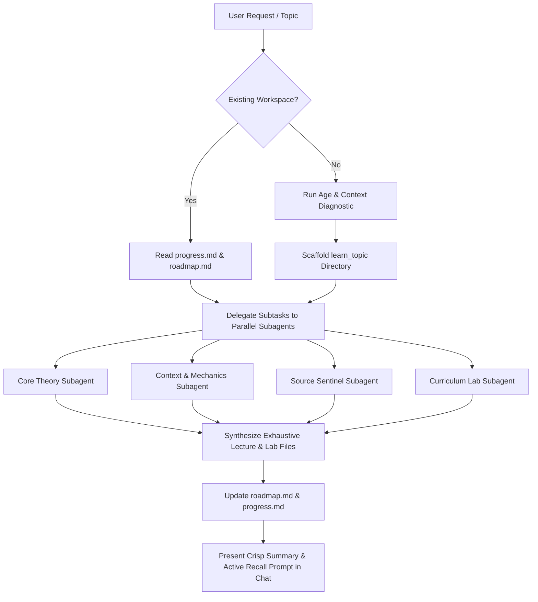

# Agent Execution Guide: Study Mentor 📖

This guide outlines operational protocols and implementation details for autonomous agents executing the `study-mentor` skill.

---

## 1. Pedagogical Calibration by Learner Age

| Age Bracket | Pedagogical Tone | Conceptual Focus | Example Feynman Analogy Style |
| :--- | :--- | :--- | :--- |
| **Young Learners (6–11)** | Story-driven, highly visual, encouraging | Concrete observables, interactive discovery | Daily objects (toys, kitchens, playgrounds) |
| **Adolescents & Teens (12–17)** | Inquiry-driven, engaging, relatable | Mechanisms, structured systems, why/how | Real-world tech, sports, gaming, nature |
| **University & Academic (18–25)** | Rigorous, analytical, formal | Axiomatic derivations, proofs, edge cases | Mathematical models, system architecture |
| **Adult Professionals & Career Switchers** | Pragmatic, 80/20 mastery, outcome-oriented | Real-world applications, production best practices | Industry workflows, architectural trade-offs |

---

## 2. Execution Workflow

---

## 3. Mandatory Output Quality Gates

1. **No Superficial Lectures**: Any generated lecture file in `lectures/` must contain at least:
   - Header with formal prerequisites and verified markdown source citations.
   - First-principles breakdown explaining the fundamental axioms.
   - Real-world Feynman mental model.
   - Comprehensive, fully worked examples / proofs / annotated code.
   - Common misconceptions, anti-patterns, and edge cases.
2. **Persistent Socratic Loop**: Never end a turn without a clear active recall challenge and an update to `progress.md`.
